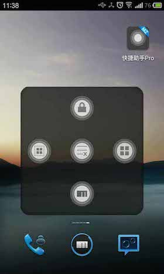

# About me
	
	一个在昆明奋斗的 程序猿
	
## 技能
  
  	Android  开发  熟练
  	
  	IOS 开发  swift 基础
  	
  	APP UI 设计  不会PS 但是可以随便画画
  	
## 项目

列举一些个人认为比较有代表性的APP 做为展示 ;（以下APP 都是我一人开发完成）
IOS 开发 swift 基础，目前没有满意的项目，所以这里只展示 Android 开发项目

------------------
###  1 快捷助手

12 年开始接触 Android 开发 并且在 9 月份在魅族应用中心上线 自己的第一个 Android 收费应用程序
	
    
总下载量 4w +  
	
13 年是繁忙的一年，没有时间进行维护和更新。此app 于 14年1月更新最后一版后，停止更新。
	
作为 自己的第一款 Android APP 能获得这样的评价，我也觉着很满意。
	
	
### 2 青海汇

13年4月 我来到了现在的公司。负责 Android 客户端开发。青海汇 就是来到公司后的第一个项目，并且开发时间紧迫。但是还是在一个月的时间内完成了该项目的开发工作。
	
 
	
 

现在回头来看 觉着UI 和细节很多方面都太随便，缺少精致感。

### 3 智农掌控

这是一个通过 Android 手机客户端 监控大棚的温湿度信息 和控制大棚 遮阳膜的 开启关闭的客户端。可以说是物联网吧。客户端比较简单，主要的工作还是后台 和 各种设备 完成的。 （由于这个客户端需要登录，我现在有没有账号了，只有一个loading 页面和登陆界面的截图 ）

### 4 新华烟草
	
一个烟草内部的 资讯类APP 界面简单，开发周期 1 个周。由于内部软件 截图不做展示
	

### 5 警世宝典
	
公司去年主推项目 打个广告  200 元 以内罚款 缴费不扣分 
	
 
 

本客户端 设计到的用户的多重权限，包括视频播放，支付宝接口，地图定位，地图展示等 。算是一个比较大的项目了。
UI 设计遵循   google 主推的 Android Design 设计。中规中矩，目前此APP 运营良好
	
### 6 桌面

14年 难度最大的项目吧。一个人负责开发 Android Launcher 。结果也还是很满意。虽然适配是一个头疼的问题
	
 

这个APP 细节很多，要实现 添加 和删除快捷方式的时候 页面总数自动改变。其中还有 自定义的应用中心，主题中心，必须实现换肤的操作。并且有一个类似新闻咨询 和 问题咨询的 功能。最重要的是适配 不同品牌 不同 版本的手机。
	
### 7 BIKE 
	
这是一个 自己和朋友的 idea ，一个纯粹的骑行社区APP 目前还未完成，在开发阶段。此APP 根据 Material Design 进行设计。本APP 界面设计简洁。
	
 
 
   	

还有一些别的APP 就不在列举。新的一年，想有一个新的提升。

## 开发 设计 工具
Eclipse , AndroidStuido , Xcode , Sketch 

## License
	Copyright 2015 sdaduanbilei

	Licensed under the Apache License, Version 2.0 (the "License");
	you may not use this file except in compliance with the License.
	You may obtain a copy of the License at

		 http://www.apache.org/licenses/LICENSE-2.0

	Unless required by applicable law or agreed to in writing, software
	distributed under the License is distributed on an "AS IS" BASIS,
	WITHOUT WARRANTIES OR CONDITIONS OF ANY KIND, either express or implied.
	See the License for the specific language governing permissions and
	limitations under the License.	
